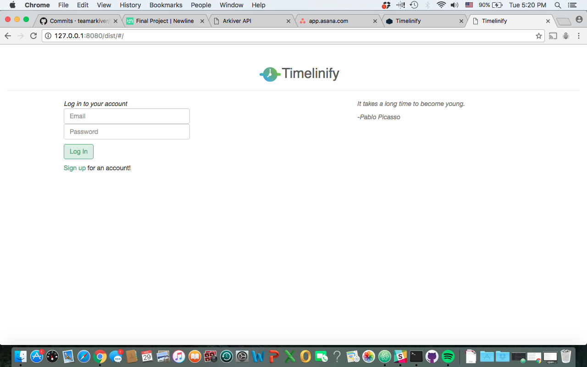
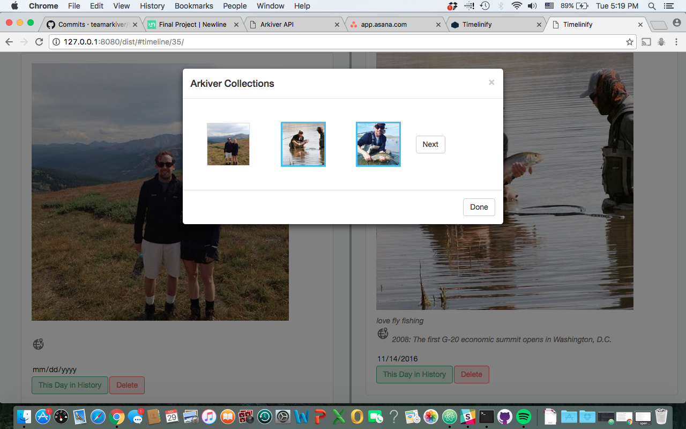

## Timelinify

###### Description:

###### This timeline tool was built in collaboration with [Arkiver](https://www.arkiver.com). The app allows users to access data from their Arkiver account to quickly create a personal timeline. Users can, after selecting a date for a timeline event, also choose to include a fact from that date in history to go along with their provided description. Users can easily create, edit and delete timelines and timeline events. This tool would be useful for teachers who wish to have an easy way to create educational content. It would also be helpful for anyone who wants to provide a concise way to document their life or the life of a family member. 

#### Technologies used:

##### React.js
##### Backbone.js
##### jQuery
##### SCSS
##### Bootstrap
##### Bootstrap-React Components
##### Arkiver API
##### This Day in History API

